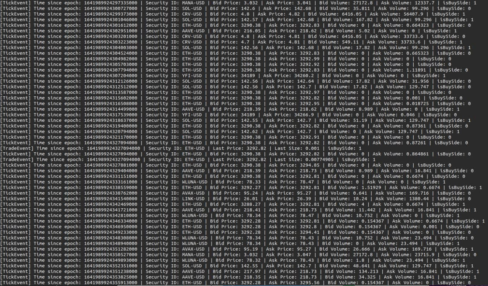

# crypto-connect

An opinionated project for connecting to Crypto Exchanges in C++20.

## Summary

This project aims to provide a common interface between the different crypto exchanges (more to come), with an opinionated approach as to what event streams are consumed and what orders can be made (GTC-only).

It is strongly advised to heavily test it in the sandbox before using it in live.


## Dependencies

1. Boost (v1.71.0+)
2. libssl-dev

## Features

- [x] Retrieve Available Products and Product Details
- [x] Market Data Stream (Bars, Ticks, Trades, OrderStatuses, Transactions)
- [x] Historical Bar Data Queries
- [x] Order Placing (GTC-only) for Market and Limit (non-margin)
- [x] Order Cancellation
- [x] Order Tracking (both as streamed event and querying it directly with REST)
- [ ] Accounts


## Build

This project is developed in Linux and should work on Unix-based systems.

Build the shared object and link it.

```shell
$ mkdir build && cd build
$ cmake .. -B . -DEXCHANGE=cbpro -DMODE=[sandbox|live]
$ make
```
You can now move the libcryptoconnect-cbpro.so shared object to either your /usr/include or your project's directory

## Usage

1. Copy the header files `include/cryptoconnect` into your project.

2. Include the adapter and implement the base strategy to handle the market events.

3. A `config.yaml` file is also expected in your project root for the provision of API keys, secrets, and passphrases as seen in [config.template.yaml](config.template.yaml).

```c++
#include "cryptoconnect/strategy.hpp"           // The base strategy class to implement
#include "cryptoconnect/structs/events.hpp"     // Event structs
#include "cryptoconnect/structs/orders.hpp"     // Order structs
#include "cryptoconnect/structs/universe.hpp"   // Universe struct

class MyStrategy : public CryptoConnect::BaseStrategy
{
public:
    void onInit()
    {
        // Some initializing logic here
    }

    void onStart()
    {
        // Logic to filter and set the trading universe
        Universe::Universe availableUniverse;
        this->adapter_->getAvailableUniverse(availableUniverse);
        ...
        Universe::Universe myUniverse({"BTC-USD", "ETH-USD"});
        this->adapter_->updateUniverse(myUniverse);
    }

    void onBar(Events::Bar bar)
    {
        // Do something when a new minute bar is aggregated
    }

    void onTick(Events::Tick tick)
    {
        // Do something when the best bid/ask is updated
    }

    void onTrade(Events::Trade trade)
    {
        // Do something when there is a trade/match in the market
        if (trade.productId_ == "BTC-USD" && trade.lastPrice_ < 40000)
        {
            Orders::MarketOrder order(Orders::Side::BUY, "BTC-USD", 1.23);
            Orders::OrderResponse response;
            this->adapter_.placeOrder(order, response);
            std::cout << response << '\n';
        }
    }

    void onOrderStatus(Events::OrderStatus orderStatus)
    {
        // Track my order statuses (received/open/done)
    }

    void onTransaction(Events::Transaction transaction)
    {
        // Get notified when my order matches
    }

    void onExit()
    {
        // Some closing logic here
    }
};

#include "cryptoconnect/adapters/coinbasepro.hpp"   // The adapter

int main()
{
    MyStrategy myStrategy;
    CryptoConnect::CoinbasePro::Adapter adapter(&myStrategy);

    adapter.start();
}
```

Example of simply logging out the events received from the stream:


More details can be found in [examples](examples/cpp).

## Future developments

1. To test the stability of the project and improve error handling
2. More exchanges
3. Possible extension for use in Python


## Contributors

- [Cheong Shiu Hong](https://github.com/cheongshiuhong)
